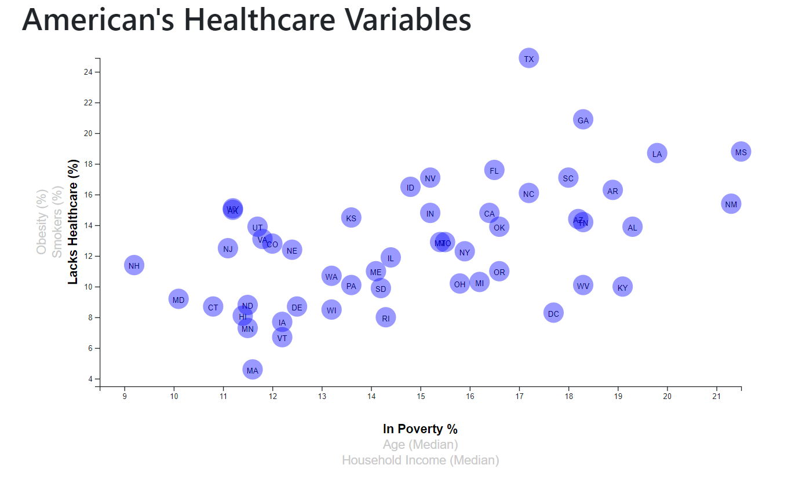

# D3-challenge

## D3 Dabbler - Required Assignment 
In this project I created a scatter plot of Healthcare vs. Poverty, including state abbreviations, locating axes to the chart left and bottom and using localhost 8000.

I additionally used toolTips as added values when pointing the mouse on the State circles. I had issues with this part, but I sorted them out. This is an updated version of the assisgnment, where I am also including the Bonus.

## D3 Bonus: Impress the Boss (Optional Assignment)
I prepared an interactive scatter plotter chart that shows how Obesity, Smokers and Lack of Healthcare vary regarding Poverty, Age and Income. Tooltips were also included in this activity.

### Data sources
* https://factfinder.census.gov/faces/nav/jsf/pages/searchresults.xhtml,

### Screenshots from the Scatter Plot

