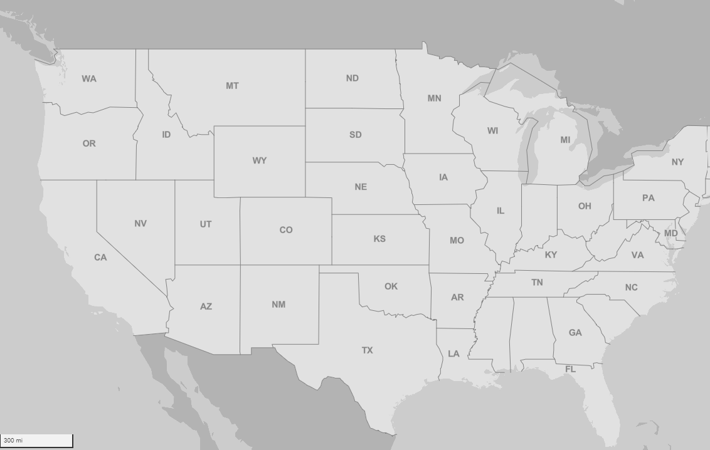
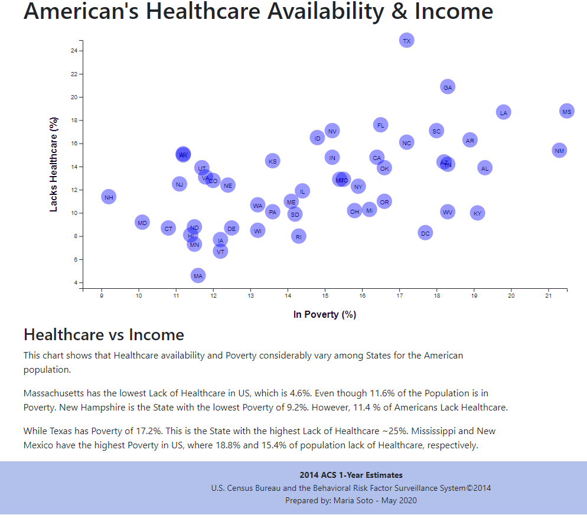

# D3-challenge

## D3 Dabbler - Required Assignment 
In this project I created a scatter plot of Healthcare vs. Poverty, including state abbreviations, locating axes to the chart left and bottom and using localhost 8000.

I additionally attempted to use toolTips as added values when pointing the mouse on the State circles, but the d3-tip tool is not working. If I solve this issue I will upload an updated version of this assisgnment. I did not push my Bonus assignment due to the same issue.

### Data sources
* https://factfinder.census.gov/faces/nav/jsf/pages/searchresults.xhtml,

### Screenshots from the Scatter Plot
